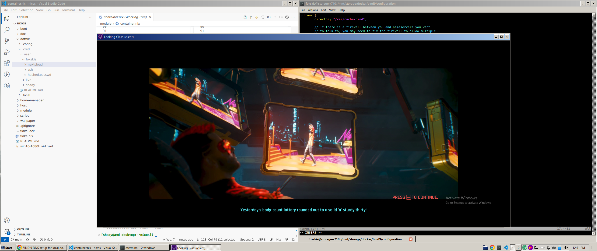

# nix-config



NixOS configuration: simple system config for my everyday usage.

## Get Started

- Clone current repository to `$HOME` folder & create symlink to `/etc/nixos`
  > sudo ln -s /home/shady/nixos /etc/nixos
- Requires contents from `passwd` repository to be placed within `./dotfile/.cred/`

## Build Installation USB (Live CD)

``` bash
nix build .#nixosConfigurations.live-usb.config.system.build.isoImage
sudo dd bs=4M if=/etc/nixos/result/iso/nixos-23.05.20231014.b85a19a-x86_64-linux.iso of=/dev/sdc conv=fdatasync  status=progress
```

## Structure

```
├── boot
│   └── uefi.nix
├── doc
│   ├── keybinding.md
│   ├── libvirt.md
│   ├── tasks.md
│   ├── useful.md
│   └── vim.md
├── dotfile
├── flake.lock
├── flake.nix
├── home-manager
│   ├── amdpc
│   │   └── default.nix
│   └── common.nix
├── host
│   ├── amdpc
│   │   ├── default.nix
│   │   └── hardware-configuration.nix
│   ├── liveusb
│   │   └── default.nix
│   └── server
│       ├── default.nix
│       └── hardware-configuration.nix
├── module
│   ├── cmd-package.nix
│   ├── container.nix
│   ├── gui.nix
│   ├── libvirt.nix
│   ├── pkgs
│   │   ├── default.nix
│   │   ├── devcontainer-cli.nix
│   │   ├── drivers
│   │   │   └── cups-brother-mfcl2800dw.nix
│   │   └── themes
│   │       ├── chicago95-theme.nix
│   │       └── raleigh-reloaded-theme.nix
│   ├── powersaver.nix
│   ├── ssh.nix
│   ├── user.nix
│   └── utility
│       └── default.nix
├── README.md
├── script
├── wallpaper
│   └── wp9205370-wallpapers.jpg
└── win10-1080ti.virt.xml
```

## Notice
Mostly complete system. I started the journey on the 29/09/23. View docs/tasks.md for more details.

